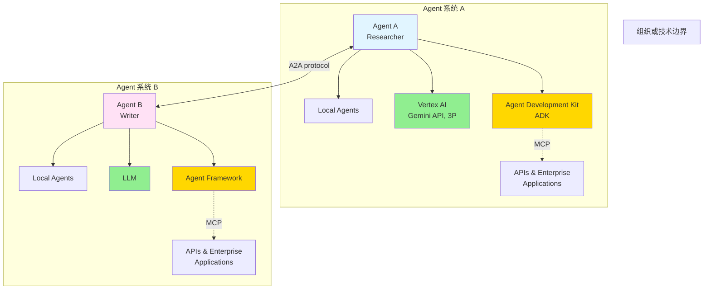

# A2A 协议使用示例

本文档提供基于真�?`python-a2a` �?(v0.5.10) 的完整使用示例�?

## A2A 架构概览



## 目录

- [1. 快速开始](#1-快速开�?
- [2. 创建 A2A Agent](#2-创建-a2a-agent)
- [3. Agent 通信](#3-agent-通信)
- [4. Agent 网络](#4-agent-网络)
- [5. Agent 注册中心](#5-agent-注册中心)
- [6. �?HelloAgents 中使用](#6-�?helloagents-中使�?

---

## 1. 快速开�?
### 安装依赖

```bash
pip install python-a2a==0.5.10
```

### 最简单的示例

```python
from hello_agents.protocols.a2a.implementation import A2AServer

# 创建 Agent 服务�?server = A2AServer(
    name="My First Agent",
    description="A simple A2A agent",
    version="1.0.0"
)

# 添加技�?def greet_skill(text: str) -> str:
    """问候技�?""
    return "Hello! I'm an A2A agent. How can I help you?"

server.add_skill("greet", greet_skill)

# 运行服务�?server.run(host="0.0.0.0", port=5000)
```

---

## 2. 创建 A2A Agent

### 2.1 基础 Agent

```python
from hello_agents.protocols.a2a.implementation import A2AServer

# 创建 Agent
agent = A2AServer(
    name="Assistant Agent",
    description="A helpful assistant",
    version="1.0.0",
    capabilities={
        "chat": True,
        "analysis": True,
        "translation": False
    }
)
```

### 2.2 添加技�?
```python
# 技�?1：文本分�?def analyze_skill(text: str) -> str:
    """分析文本"""
    import re
    match = re.search(r'analyze\s+(.+)', text, re.IGNORECASE)
    if match:
        content = match.group(1).strip()
        word_count = len(content.split())
        char_count = len(content)
        return f"Analysis: {word_count} words, {char_count} characters"
    return "Please provide text to analyze"

agent.add_skill("analyze", analyze_skill)

# 技�?2：翻�?def translate_skill(text: str) -> str:
    """翻译文本"""
    import re
    match = re.search(r'translate\s+(.+)', text, re.IGNORECASE)
    if match:
        content = match.group(1).strip()
        # 简单的模拟翻译
        return f"Translated: {content.upper()}"
    return "Please provide text to translate"

agent.add_skill("translate", translate_skill)

# 技�?3：计�?def calculate_skill(text: str) -> str:
    """计算数学表达�?""
    import re
    match = re.search(r'calculate\s+(.+)', text, re.IGNORECASE)
    if match:
        expression = match.group(1).strip()
        try:
            result = eval(expression)
            return f"Result: {result}"
        except Exception as e:
            return f"Calculation error: {str(e)}"
    return "Please provide an expression to calculate"

agent.add_skill("calculate", calculate_skill)
```

### 2.3 完整�?Agent 示例

```python
from hello_agents.protocols.a2a.implementation import A2AServer

# 创建多功�?Agent
agent = A2AServer(
    name="Multi-Skill Agent",
    description="An agent with multiple skills",
    version="1.0.0",
    capabilities={
        "text_processing": True,
        "data_analysis": True,
        "calculation": True
    }
)

# 添加所有技�?skills = {
    "greet": lambda text: "Hello! How can I help you?",
    "analyze": analyze_skill,
    "translate": translate_skill,
    "calculate": calculate_skill
}

for name, func in skills.items():
    agent.add_skill(name, func)

# 获取 Agent 信息
info = agent.get_info()
print(f"Agent: {info['name']}")
print(f"Version: {info['version']}")
print(f"Capabilities: {info['capabilities']}")

# 运行 Agent
if __name__ == "__main__":
    print(f"🚀 Starting {agent.agent_card.name}...")
    agent.run(host="0.0.0.0", port=5000)
```

---

## 3. Agent 通信

### 3.1 创建客户�?
```python
from hello_agents.protocols.a2a.implementation import A2AClient

# 连接�?Agent
client = A2AClient("http://localhost:5000")

# 获取 Agent 信息
info = client.get_info()
print(f"Connected to: {info}")
```

### 3.2 发送消�?
```python
# 简单提�?response = client.ask("Hello, how are you?")
print(f"Agent response: {response}")

# 请求分析
response = client.ask("analyze This is a sample text for analysis")
print(f"Analysis result: {response}")

# 请求计算
response = client.ask("calculate 2 + 2 * 3")
print(f"Calculation result: {response}")
```

### 3.3 完整的通信示例

```python
from hello_agents.protocols.a2a.implementation import A2AClient

def communicate_with_agent(agent_url: str):
    """�?Agent 通信的完整示�?""
    client = A2AClient(agent_url)
    
    # 1. 获取 Agent 信息
    print("=== Agent Information ===")
    info = client.get_info()
    for key, value in info.items():
        print(f"{key}: {value}")
    
    # 2. 发送多个请�?    print("\n=== Communication ===")
    requests = [
        "Hello!",
        "analyze The quick brown fox jumps over the lazy dog",
        "calculate 10 * 5 + 3",
        "translate Hello World"
    ]
    
    for req in requests:
        print(f"\nRequest: {req}")
        response = client.ask(req)
        print(f"Response: {response}")

# 使用示例
if __name__ == "__main__":
    communicate_with_agent("http://localhost:5000")
```

---

## 4. Agent 网络

### 4.1 创建 Agent 网络

```python
from hello_agents.protocols.a2a.implementation import AgentNetwork

# 创建网络
network = AgentNetwork(name="My Agent Network")

# 添加 Agent
network.add_agent("agent1", "http://localhost:5001")
network.add_agent("agent2", "http://localhost:5002")
network.add_agent("agent3", "http://localhost:5003")

# 列出所�?Agent
agents = network.list_agents()
print(f"Network has {len(agents)} agents")
```

### 4.2 Agent 发现

```python
# �?URL 列表中发�?Agent
urls = [
    "http://localhost:5001",
    "http://localhost:5002",
    "http://localhost:5003",
    "http://localhost:5004"
]

discovered = network.discover_agents(urls)
print(f"Discovered {discovered} agents")
```

### 4.3 使用网络中的 Agent

```python
# 获取特定 Agent
agent1_client = network.get_agent("agent1")

# �?Agent 通信
response = agent1_client.ask("Hello from the network!")
print(f"Agent1 response: {response}")
```

### 4.4 完整的网络示�?
```python
from hello_agents.protocols.a2a.implementation import (
    A2AServer,
    AgentNetwork
)
import threading
import time

def start_agent_server(name: str, port: int):
    """启动 Agent 服务�?""
    agent = A2AServer(
        name=name,
        description=f"Agent {name}",
        version="1.0.0"
    )
    
    # 添加简单技�?    agent.add_skill("greet", lambda text: f"Hello from {name}!")
    
    # 在新线程中运�?    agent.run(host="0.0.0.0", port=port)

def network_example():
    """Agent 网络示例"""
    # 启动多个 Agent（在实际应用中，这些可能在不同的机器上）
    agents_config = [
        ("Agent1", 5001),
        ("Agent2", 5002),
        ("Agent3", 5003)
    ]
    
    # 启动 Agent 服务器（在实际应用中使用多进程）
    threads = []
    for name, port in agents_config:
        thread = threading.Thread(
            target=start_agent_server,
            args=(name, port),
            daemon=True
        )
        thread.start()
        threads.append(thread)
    
    # 等待服务器启�?    time.sleep(2)
    
    # 创建网络
    network = AgentNetwork(name="Example Network")
    
    # 添加 Agent
    for name, port in agents_config:
        network.add_agent(name, f"http://localhost:{port}")
    
    # 与每�?Agent 通信
    for name, _ in agents_config:
        client = network.get_agent(name)
        response = client.ask("Hello!")
        print(f"{name}: {response}")

if __name__ == "__main__":
    network_example()
```

---

## 5. Agent 注册中心

### 5.1 创建注册中心

```python
from hello_agents.protocols.a2a.implementation import AgentRegistry

# 创建注册中心
registry = AgentRegistry(
    name="Central Registry",
    description="Central agent registry for the network"
)

# 获取注册中心信息
info = registry.get_info()
print(f"Registry: {info['name']}")
print(f"Type: {info['type']}")
```

### 5.2 运行注册中心

```python
# 运行注册中心服务�?if __name__ == "__main__":
    registry = AgentRegistry(
        name="Production Registry",
        description="Production agent registry"
    )
    
    print(f"🚀 Starting {registry.name}...")
    print(f"📝 {registry.description}")
    print(f"🔌 Protocol: A2A")
    print(f"📡 Port: 8000")
    print()
    
    registry.run(host="0.0.0.0", port=8000)
```

### 5.3 完整的注册中心示�?
```python
from hello_agents.protocols.a2a.implementation import (
    AgentRegistry,
    A2AServer
)
import threading
import time

def registry_example():
    """注册中心完整示例"""
    
    # 1. 启动注册中心
    registry = AgentRegistry(
        name="Example Registry",
        description="Example agent registry"
    )
    
    registry_thread = threading.Thread(
        target=lambda: registry.run(host="0.0.0.0", port=8000),
        daemon=True
    )
    registry_thread.start()
    
    print("�?Registry started on port 8000")
    time.sleep(1)
    
    # 2. 启动多个 Agent 并注册到注册中心
    agents = []
    for i in range(3):
        agent = A2AServer(
            name=f"Agent{i+1}",
            description=f"Example agent {i+1}",
            version="1.0.0"
        )
        agent.add_skill("greet", lambda text: f"Hello from Agent{i+1}!")
        
        # 在新线程中运�?        port = 5001 + i
        thread = threading.Thread(
            target=lambda p=port, a=agent: a.run(host="0.0.0.0", port=p),
            daemon=True
        )
        thread.start()
        agents.append((f"Agent{i+1}", port))
        
        print(f"�?Agent{i+1} started on port {port}")
    
    time.sleep(2)
    
    # 3. Agent 可以通过注册中心发现彼此
    print("\n📡 Agents can now discover each other through the registry")
    print("Registry URL: http://localhost:8000")
    
    # 保持运行
    try:
        while True:
            time.sleep(1)
    except KeyboardInterrupt:
        print("\n👋 Shutting down...")

if __name__ == "__main__":
    registry_example()
```

---

## 6. �?HelloAgents 中使�?
### 6.1 作为工具使用

```python
from hello_agents import SimpleAgent, HelloAgentsLLM
from hello_agents.tools.builtin import A2ATool
from dotenv import load_dotenv

load_dotenv()

# 创建 Agent
agent = SimpleAgent(
    name="A2A Assistant",
    llm=HelloAgentsLLM()
)

# 添加 A2A 工具
a2a_tool = A2ATool(agent_url="http://localhost:5000")
agent.add_tool(a2a_tool)

# 使用 Agent
response = agent.run("请向 A2A Agent 提问：你好吗�?)
print(response)
```

### 6.2 完整示例

```python
from hello_agents import SimpleAgent, HelloAgentsLLM
from hello_agents.tools.builtin import A2ATool
from hello_agents.protocols.a2a.implementation import A2AServer
from dotenv import load_dotenv
import threading
import time

load_dotenv()

def complete_example():
    """完整�?A2A 集成示例"""
    
    # 1. 启动 A2A Agent 服务�?    a2a_agent = A2AServer(
        name="Data Processor",
        description="An agent that processes data",
        version="1.0.0",
        capabilities={"analysis": True, "calculation": True}
    )
    
    # 添加技�?    def analyze_skill(text: str) -> str:
        import re
        match = re.search(r'analyze\s+(.+)', text, re.IGNORECASE)
        if match:
            content = match.group(1).strip()
            return f"Analysis: {len(content.split())} words, {len(content)} chars"
        return "Please provide text to analyze"
    
    a2a_agent.add_skill("analyze", analyze_skill)
    
    # 在后台运�?    server_thread = threading.Thread(
        target=lambda: a2a_agent.run(host="0.0.0.0", port=5000),
        daemon=True
    )
    server_thread.start()
    
    print("�?A2A Agent started on port 5000")
    time.sleep(2)
    
    # 2. 创建 HelloAgents Agent 并添�?A2A 工具
    agent = SimpleAgent(
        name="Coordinator",
        llm=HelloAgentsLLM(),
        system_prompt="You are a coordinator that can communicate with other agents."
    )
    
    a2a_tool = A2ATool(agent_url="http://localhost:5000")
    agent.add_tool(a2a_tool)
    
    # 3. 执行任务
    tasks = [
        "获取 A2A Agent 的信�?,
        "�?A2A Agent 分析这段文本：The quick brown fox jumps over the lazy dog"
    ]
    
    for task in tasks:
        print(f"\n{'='*60}")
        print(f"Task: {task}")
        print(f"{'='*60}")
        response = agent.run(task)
        print(f"Response: {response}")
    
    print("\n�?Example completed!")

if __name__ == "__main__":
    complete_example()
```

---

## 总结

本文档展示了如何使用基于真实 `python-a2a` 库的 A2A 协议实现�?
1. **Agent 创建**：创�?A2A Agent 服务器，添加技�?2. **Agent 通信**：使用客户端�?Agent 通信
3. **Agent 网络**：构建和管理 Agent 网络
4. **注册中心**：使用注册中心进行服务发�?5. **集成**：在 HelloAgents 框架中使�?A2A 工具

更多信息请参考：
- [python-a2a 文档](https://github.com/google/python-a2a)
- [HelloAgents 文档](../../../README.md)

