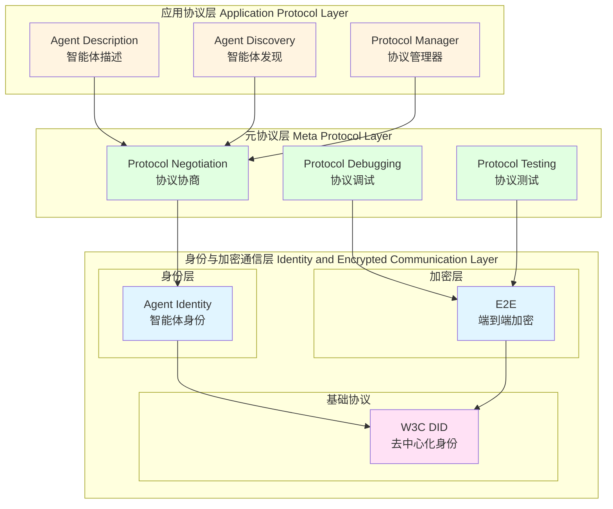

# ANP 协议使用示例

本文档提供基�?`agent-connect` �?(v0.3.7) �?ANP 协议使用示例�?

## ANP 架构概览



## 目录

- [1. 快速开始](#1-快速开�?
- [2. 服务发现](#2-服务发现)
- [3. 网络管理](#3-网络管理)
- [4. 消息路由](#4-消息路由)
- [5. 完整示例](#5-完整示例)
- [6. �?HelloAgents 中使用](#6-�?helloagents-中使�?

---

## 1. 快速开�?
### 安装依赖

```bash
pip install agent-connect==0.3.7
```

### 最简单的示例

```python
from hello_agents.protocols.anp.implementation import (
    ANPDiscovery,
    ServiceInfo
)

# 创建服务发现
discovery = ANPDiscovery()

# 注册服务
service = ServiceInfo(
    service_id="agent1",
    service_type="nlp_processor",
    endpoint="http://localhost:8001",
    metadata={"version": "1.0.0"}
)
discovery.register_service(service)

# 发现服务
services = discovery.discover_services(service_type="nlp_processor")
print(f"Found {len(services)} services")
```

---

## 2. 服务发现

### 2.1 注册服务

```python
from hello_agents.protocols.anp.implementation import (
    ANPDiscovery,
    ServiceInfo
)

# 创建服务发现实例
discovery = ANPDiscovery()

# 注册多个服务
services = [
    ServiceInfo(
        service_id="nlp_agent",
        service_type="nlp_processor",
        endpoint="http://localhost:8001",
        metadata={
            "version": "1.0.0",
            "capabilities": ["text_analysis", "sentiment_analysis"],
            "max_load": 100
        }
    ),
    ServiceInfo(
        service_id="data_agent",
        service_type="data_processor",
        endpoint="http://localhost:8002",
        metadata={
            "version": "1.0.0",
            "capabilities": ["data_cleaning", "data_transformation"],
            "max_load": 50
        }
    ),
    ServiceInfo(
        service_id="ml_agent",
        service_type="ml_processor",
        endpoint="http://localhost:8003",
        metadata={
            "version": "2.0.0",
            "capabilities": ["training", "inference"],
            "gpu_enabled": True
        }
    )
]

for service in services:
    success = discovery.register_service(service)
    print(f"�?Registered {service.service_id}: {success}")
```

### 2.2 发现服务

```python
# 发现所有服�?all_services = discovery.list_all_services()
print(f"Total services: {len(all_services)}")

# 按类型发现服�?nlp_services = discovery.discover_services(service_type="nlp_processor")
print(f"NLP services: {[s.service_id for s in nlp_services]}")

# 按元数据过滤
gpu_services = discovery.discover_services(
    filters={"gpu_enabled": True}
)
print(f"GPU-enabled services: {[s.service_id for s in gpu_services]}")

# 组合过滤
ml_v2_services = discovery.discover_services(
    service_type="ml_processor",
    filters={"version": "2.0.0"}
)
print(f"ML v2.0 services: {[s.service_id for s in ml_v2_services]}")
```

### 2.3 获取和注销服务

```python
# 获取特定服务
service = discovery.get_service("nlp_agent")
if service:
    print(f"Service: {service.service_id}")
    print(f"Endpoint: {service.endpoint}")
    print(f"Metadata: {service.metadata}")

# 注销服务
success = discovery.unregister_service("nlp_agent")
print(f"Unregistered: {success}")
```

### 2.4 完整的服务发现示�?
```python
from hello_agents.protocols.anp.implementation import (
    ANPDiscovery,
    ServiceInfo
)

def service_discovery_example():
    """服务发现完整示例"""
    discovery = ANPDiscovery()
    
    # 1. 注册多种类型的服�?    print("=== Registering Services ===")
    services_config = [
        ("agent1", "nlp", "http://localhost:8001", {"lang": "en"}),
        ("agent2", "nlp", "http://localhost:8002", {"lang": "zh"}),
        ("agent3", "data", "http://localhost:8003", {"db": "postgres"}),
        ("agent4", "ml", "http://localhost:8004", {"gpu": True}),
    ]
    
    for sid, stype, endpoint, metadata in services_config:
        service = ServiceInfo(sid, stype, endpoint, metadata)
        discovery.register_service(service)
        print(f"�?Registered {sid}")
    
    # 2. 发现服务
    print("\n=== Discovering Services ===")
    
    # 所�?NLP 服务
    nlp_services = discovery.discover_services(service_type="nlp")
    print(f"NLP services: {[s.service_id for s in nlp_services]}")
    
    # 中文 NLP 服务
    zh_nlp = discovery.discover_services(
        service_type="nlp",
        filters={"lang": "zh"}
    )
    print(f"Chinese NLP services: {[s.service_id for s in zh_nlp]}")
    
    # GPU 服务
    gpu_services = discovery.discover_services(filters={"gpu": True})
    print(f"GPU services: {[s.service_id for s in gpu_services]}")
    
    # 3. 获取服务详情
    print("\n=== Service Details ===")
    for service in discovery.list_all_services():
        print(f"\nService: {service.service_id}")
        print(f"  Type: {service.service_type}")
        print(f"  Endpoint: {service.endpoint}")
        print(f"  Metadata: {service.metadata}")
    
    # 4. 注销服务
    print("\n=== Unregistering Services ===")
    discovery.unregister_service("agent1")
    print(f"Remaining services: {len(discovery.list_all_services())}")

if __name__ == "__main__":
    service_discovery_example()
```

---

## 3. 网络管理

### 3.1 创建网络

```python
from hello_agents.protocols.anp.implementation import ANPNetwork

# 创建网络
network = ANPNetwork(network_id="production_network")

# 添加节点
network.add_node(
    node_id="node1",
    endpoint="http://localhost:8001",
    metadata={"role": "coordinator", "region": "us-west"}
)

network.add_node(
    node_id="node2",
    endpoint="http://localhost:8002",
    metadata={"role": "worker", "region": "us-east"}
)

network.add_node(
    node_id="node3",
    endpoint="http://localhost:8003",
    metadata={"role": "worker", "region": "eu-west"}
)
```

### 3.2 连接节点

```python
# 建立节点间的连接
network.connect_nodes("node1", "node2")  # coordinator -> worker1
network.connect_nodes("node1", "node3")  # coordinator -> worker2
network.connect_nodes("node2", "node3")  # worker1 -> worker2

# 获取网络统计
stats = network.get_network_stats()
print(f"Network: {stats['network_id']}")
print(f"Total nodes: {stats['total_nodes']}")
print(f"Active nodes: {stats['active_nodes']}")
print(f"Total connections: {stats['total_connections']}")
```

### 3.3 节点管理

```python
# 获取节点信息
node_info = network.get_node_info("node1")
if node_info:
    print(f"Node: {node_info['node_id']}")
    print(f"Endpoint: {node_info['endpoint']}")
    print(f"Status: {node_info['status']}")
    print(f"Connections: {node_info['connections']}")
    print(f"Metadata: {node_info['metadata']}")

# 移除节点
success = network.remove_node("node3")
print(f"Node removed: {success}")

# 更新后的统计
stats = network.get_network_stats()
print(f"Nodes after removal: {stats['total_nodes']}")
```

### 3.4 完整的网络管理示�?
```python
from hello_agents.protocols.anp.implementation import ANPNetwork

def network_management_example():
    """网络管理完整示例"""
    network = ANPNetwork(network_id="example_network")
    
    # 1. 构建网络拓扑
    print("=== Building Network Topology ===")
    
    # 添加协调节点
    network.add_node(
        "coordinator",
        "http://localhost:8000",
        {"role": "coordinator", "priority": 10}
    )
    
    # 添加工作节点
    for i in range(1, 4):
        network.add_node(
            f"worker{i}",
            f"http://localhost:800{i}",
            {"role": "worker", "priority": 5}
        )
    
    # 添加存储节点
    network.add_node(
        "storage",
        "http://localhost:8010",
        {"role": "storage", "priority": 8}
    )
    
    # 2. 建立连接（星型拓扑）
    print("\n=== Establishing Connections ===")
    for i in range(1, 4):
        network.connect_nodes("coordinator", f"worker{i}")
        network.connect_nodes(f"worker{i}", "storage")
    
    # 3. 显示网络信息
    print("\n=== Network Information ===")
    stats = network.get_network_stats()
    for key, value in stats.items():
        print(f"{key}: {value}")
    
    # 4. 显示每个节点的详细信�?    print("\n=== Node Details ===")
    for node_id in stats['nodes']:
        info = network.get_node_info(node_id)
        print(f"\n{node_id}:")
        print(f"  Endpoint: {info['endpoint']}")
        print(f"  Status: {info['status']}")
        print(f"  Connections: {info['connections']}")
        print(f"  Metadata: {info['metadata']}")

if __name__ == "__main__":
    network_management_example()
```

---

## 4. 消息路由

### 4.1 简单路�?
```python
from hello_agents.protocols.anp.implementation import ANPNetwork

# 创建网络并建立连�?network = ANPNetwork()
network.add_node("node1", "http://localhost:8001")
network.add_node("node2", "http://localhost:8002")
network.connect_nodes("node1", "node2")

# 路由消息
message = {"type": "task", "content": "Process data"}
path = network.route_message("node1", "node2", message)

if path:
    print(f"Message routed: {' -> '.join(path)}")
else:
    print("No route found")
```

### 4.2 多跳路由

```python
# 创建更复杂的网络
network = ANPNetwork()

# 添加节点
for i in range(1, 5):
    network.add_node(f"node{i}", f"http://localhost:800{i}")

# 建立连接：node1 -> node2 -> node3 -> node4
network.connect_nodes("node1", "node2")
network.connect_nodes("node2", "node3")
network.connect_nodes("node3", "node4")

# 路由消息（需要中转）
message = {"type": "data", "payload": "important data"}
path = network.route_message("node1", "node3", message)

if path:
    print(f"Multi-hop route: {' -> '.join(path)}")
```

### 4.3 广播消息

```python
# 广播消息到所有连接的节点
message = {"type": "broadcast", "content": "System update"}
recipients = network.broadcast_message("node1", message)

print(f"Message broadcasted to: {', '.join(recipients)}")
```

### 4.4 完整的路由示�?
```python
from hello_agents.protocols.anp.implementation import ANPNetwork

def routing_example():
    """消息路由完整示例"""
    network = ANPNetwork(network_id="routing_network")
    
    # 1. 构建网络（网状拓扑）
    print("=== Building Network ===")
    nodes = ["A", "B", "C", "D", "E"]
    for node in nodes:
        network.add_node(node, f"http://localhost:800{ord(node)-64}")
    
    # 建立连接
    connections = [
        ("A", "B"), ("A", "C"),
        ("B", "C"), ("B", "D"),
        ("C", "D"), ("C", "E"),
        ("D", "E")
    ]
    for from_node, to_node in connections:
        network.connect_nodes(from_node, to_node)
    
    # 2. 测试不同的路由场�?    print("\n=== Routing Tests ===")
    
    # 直接路由
    path = network.route_message("A", "B", {"msg": "direct"})
    print(f"A -> B (direct): {' -> '.join(path) if path else 'No route'}")
    
    # 一跳路�?    path = network.route_message("A", "D", {"msg": "one hop"})
    print(f"A -> D (one hop): {' -> '.join(path) if path else 'No route'}")
    
    # 无法路由（没有连接）
    path = network.route_message("E", "A", {"msg": "no route"})
    print(f"E -> A (no route): {' -> '.join(path) if path else 'No route'}")
    
    # 3. 广播测试
    print("\n=== Broadcast Test ===")
    recipients = network.broadcast_message("A", {"msg": "broadcast from A"})
    print(f"A broadcasted to: {', '.join(recipients)}")
    
    recipients = network.broadcast_message("C", {"msg": "broadcast from C"})
    print(f"C broadcasted to: {', '.join(recipients)}")

if __name__ == "__main__":
    routing_example()
```

---

## 5. 完整示例

### 5.1 综合示例：服务发�?+ 网络管理

```python
from hello_agents.protocols.anp.implementation import (
    ANPDiscovery,
    ANPNetwork,
    ServiceInfo
)

def comprehensive_example():
    """ANP 协议综合示例"""
    
    # 1. 服务发现
    print("=== Service Discovery ===")
    discovery = ANPDiscovery()
    
    # 注册服务
    services = [
        ServiceInfo("nlp1", "nlp", "http://localhost:8001", {"lang": "en"}),
        ServiceInfo("nlp2", "nlp", "http://localhost:8002", {"lang": "zh"}),
        ServiceInfo("db1", "database", "http://localhost:8003", {"type": "postgres"}),
    ]
    
    for service in services:
        discovery.register_service(service)
        print(f"�?Registered {service.service_id}")
    
    # 2. 网络管理
    print("\n=== Network Management ===")
    network = ANPNetwork(network_id="production")
    
    # 根据发现的服务创建网络节�?    for service in discovery.list_all_services():
        network.add_node(
            service.service_id,
            service.endpoint,
            service.metadata
        )
        print(f"�?Added node {service.service_id}")
    
    # 建立连接
    network.connect_nodes("nlp1", "db1")
    network.connect_nodes("nlp2", "db1")
    
    # 3. 服务查询和路�?    print("\n=== Service Query and Routing ===")
    
    # 查找 NLP 服务
    nlp_services = discovery.discover_services(service_type="nlp")
    print(f"Found NLP services: {[s.service_id for s in nlp_services]}")
    
    # 路由消息到数据库
    for nlp_service in nlp_services:
        path = network.route_message(
            nlp_service.service_id,
            "db1",
            {"query": "SELECT * FROM users"}
        )
        if path:
            print(f"Route {nlp_service.service_id} -> db1: {' -> '.join(path)}")
    
    # 4. 网络统计
    print("\n=== Network Statistics ===")
    stats = network.get_network_stats()
    for key, value in stats.items():
        print(f"{key}: {value}")

if __name__ == "__main__":
    comprehensive_example()
```

---

## 6. �?HelloAgents 中使�?
### 6.1 作为工具使用

```python
from hello_agents import SimpleAgent, HelloAgentsLLM
from hello_agents.tools.builtin import ANPTool
from dotenv import load_dotenv

load_dotenv()

# 创建 Agent
agent = SimpleAgent(
    name="Network Manager",
    llm=HelloAgentsLLM()
)

# 添加 ANP 工具
anp_tool = ANPTool()
agent.add_tool(anp_tool)

# 使用 Agent
response = agent.run("注册一�?NLP 服务，ID �?nlp1，端点为 http://localhost:8001")
print(response)
```

### 6.2 完整示例

```python
from hello_agents import SimpleAgent, HelloAgentsLLM
from hello_agents.tools.builtin import ANPTool
from dotenv import load_dotenv

load_dotenv()

def helloagents_anp_example():
    """HelloAgents 中使�?ANP 的完整示�?""
    
    # 创建 Agent
    agent = SimpleAgent(
        name="Network Administrator",
        llm=HelloAgentsLLM(),
        system_prompt="You are a network administrator managing an agent network using ANP protocol."
    )
    
    # 添加 ANP 工具
    anp_tool = ANPTool()
    agent.add_tool(anp_tool)
    
    # 执行一系列网络管理任务
    tasks = [
        "注册一�?NLP 服务：service_id=nlp1, service_type=nlp, endpoint=http://localhost:8001",
        "注册一个数据库服务：service_id=db1, service_type=database, endpoint=http://localhost:8002",
        "发现所�?NLP 类型的服�?,
        "添加一个网络节点：node_id=node1, endpoint=http://localhost:8001",
        "添加另一个网络节点：node_id=node2, endpoint=http://localhost:8002",
        "获取网络统计信息"
    ]
    
    for task in tasks:
        print(f"\n{'='*60}")
        print(f"Task: {task}")
        print(f"{'='*60}")
        response = agent.run(task)
        print(f"Response: {response}")
    
    print("\n�?Network management tasks completed!")

if __name__ == "__main__":
    helloagents_anp_example()
```

---

## 总结

本文档展示了如何使用基于 `agent-connect` 库的 ANP 协议实现�?
1. **服务发现**：注册、发现和管理服务
2. **网络管理**：创建节点、建立连接、管理网络拓�?3. **消息路由**：点对点路由、多跳路由、广播消�?4. **集成**：在 HelloAgents 框架中使�?ANP 工具

更多信息请参考：
- [agent-connect 文档](https://github.com/agent-connect/agent-connect)
- [HelloAgents 文档](../../../README.md)

